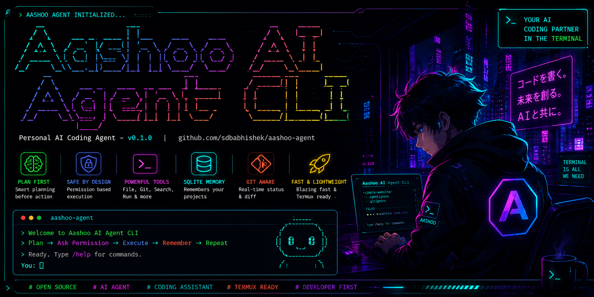
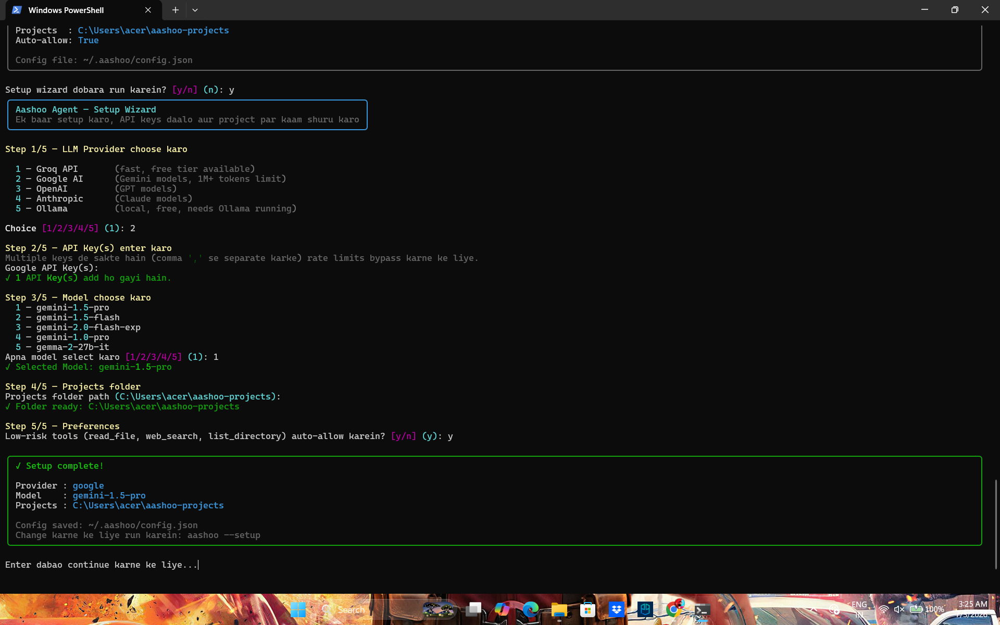
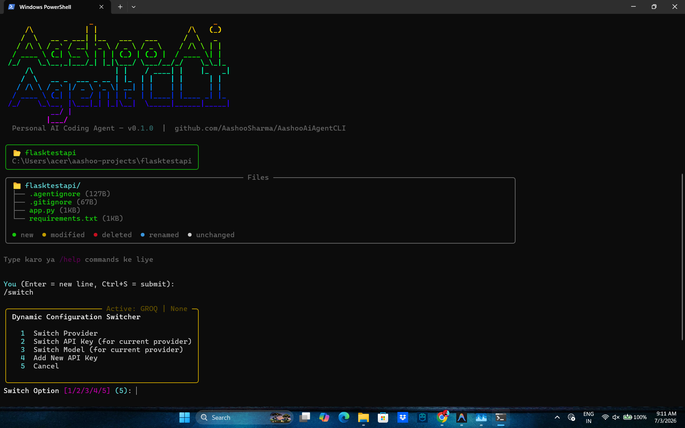
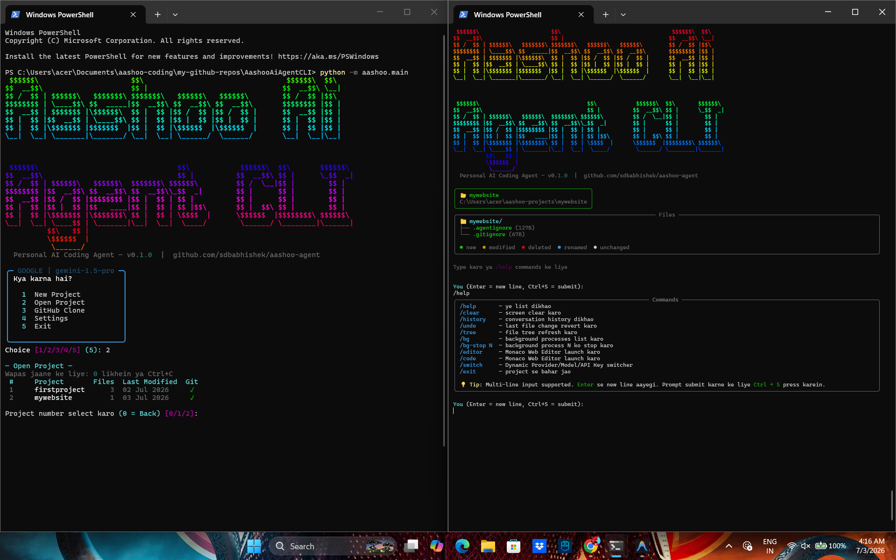

# <p align="center"><br>Aashoo AI Agent CLI</p>

<p align="center">
  
</p>

<p align="center">
  <a href="https://github.com/AashooSharma/AashooAiAgentCLI/blob/main/LICENSE"></a>
  <a href="https://www.python.org/"></a>
  
</p>

---

### <p align="center">⚡ **An open-source, lightweight AI Coding Agent that runs directly inside your terminal.** ⚡</p>
<p align="center"><i>Plan → Ask Permission → Execute → Remember → Repeat.</i></p>

**Aashoo AI Agent CLI** is a developer-first AI coding assistant that helps you build, edit, test, and manage software using natural language. Built with portability and power in mind, Aashoo keeps you in complete control through an interactive, permission-based execution model. 

Unlike other heavy agents, it is **optimized for speed, Git-aware, and fully Termux-compatible**, allowing you to run state-of-the-art coding workflows even in resource-constrained or mobile terminal environments.

---

## 🛠️ Multi-LLM & Rate Limit Bypass Setup
Aashoo supports multiple API keys per provider to seamlessly bypass API rate limits on the fly. Supported providers include:

*   **Groq API**: High-speed inference using LLaMA models.
*   **Google Gemini**: Long-context reasoning (including **Gemini 1.5 Pro** with 1M+ tokens limit).
*   **OpenAI GPT**: Industry-standard GPT-4o models.
*   **Anthropic Claude**: Premier coding capabilities with Claude 3.5 Sonnet.
*   **Ollama**: Complete local execution on your machine.

---

## ✨ Features

*   **🧠 Plan-First Workflow**: For complex requests, the agent generates a step-by-step markdown plan. You can approve, edit, or reject the plan before any tool starts executing.
*   **🔒 Safety Permission System**: High-risk operations (modifying files, running shell commands) require explicit approval (`Allow`, `Always Allow`, `Deny`, `Deny + Reason`, or `Stop Agent`). Low-risk tools (reading files, directory walks) run automatically.
*   **🚀 Background Process Manager**: Start, list, stop, and inspect the logs of background servers (e.g. Flask, Django, Node.js) directly inside your agent session without blocking the main terminal prompt.
*   **🔄 Dynamic Config Switcher**: Switch providers, models, or cycle active API keys in real time using the `/switch` command without stopping active project work.
*   **🌳 Git-Aware File Tree**: A real-time, git-status colored file tree that auto-refreshes on codebase changes.
*   **📖 Precise Tools**: Range editors, precise regex codebase search, function outlines, test suites, and instant search engines.

---

## 📸 Screenshots & Demos

### 1. Interactive Setup Wizard
<p align="center">
  
</p>

### 2. Multi-LLM Dynamic Switcher (`/switch`)
<p align="center">
  
</p>

### 3. Agent Running & Coding Workflows
<p align="center">
  
</p>

---

## 🚀 Installation & Setup

### Prerequisites
*   Python 3.9 or higher
*   Git

### 1. Clone the Repository
```bash
git clone https://github.com/AashooSharma/AashooAiAgentCLI.git
cd AashooAiAgentCLI
```

### 2. Platform-Specific Setup

#### 📱 Termux (Android Mobile)
Make sure your environment packages are updated and setup python/git:
```bash
# Update packages and install dependencies
pkg update -y
pkg install python git ripgrep termux-api -y

# Setup virtual environment
python -m venv venv
source venv/bin/activate

# Install requirements
pip install -r requirements.txt
```

#### 🐧 Linux & macOS
```bash
# Setup virtual environment
python -m venv venv
source venv/bin/activate

# Install requirements
pip install -r requirements.txt
```

#### 🪟 Windows (Powershell)
```powershell
# Setup virtual environment
python -m venv venv
venv\Scripts\Activate.ps1

# Install requirements
pip install -r requirements.txt
```

---

### 3. Running the Setup Wizard
Run the interactive wizard to set up your providers, API keys (comma-separated if entering multiple keys to bypass rate limits), models, and project directory:
```bash
python -m aashoo.main --setup
```

Start the agent CLI session:
```bash
python -m aashoo.main
```

---

## 💬 Supported Slash Commands

Inside the agent session, you can use the following commands to speed up your work:
*   `/help` — Show help listing of all commands.
*   `/switch` or `/api` — Open the dynamic LLM provider, API key, and model selector.
*   `/clear` — Clear the console screen.
*   `/tree` — Reprint the git-status colored file tree.
*   `/history` — Show conversation history.
*   `/undo` — Revert the last file modification made by the agent.
*   `/bg` — List all active background processes.
*   `/bg-stop <id>` — Stop the background process by its ID (e.g. `/bg-stop 1`).
*   `/editor` or `/code` — Launch the Monaco Web Editor.
*   `/exit` or `exit` — Exit the active project session.

---

## 📁 Project Structure

```text
AashooAiAgentCLI/
│
├── aashoo/
│   ├── agent/
│   │   ├── loop.py         # Main agent loop logic & permission checks
│   │   ├── memory.py       # SQLite database queries & memory management
│   │   └── tools.py        # All built-in tools (file/cmd/search/bg tools)
│   │
│   ├── llm/
│   │   ├── __init__.py     # Exports LLM clients & factory launcher
│   │   ├── base.py         # Abstract LLM client base
│   │   ├── groq.py         # Groq LLM integration
│   │   ├── google.py       # Google Gemini integration
│   │   ├── openai.py       # OpenAI GPT integration
│   │   ├── anthropic.py    # Anthropic Claude integration
│   │   └── ollama.py       # Ollama integration
│   │
│   ├── projects/
│   │   └── manager.py      # Project creator and manager
│   │
│   ├── ui/
│   │   ├── file_tree.py    # Git-aware file tree renderer
│   │   └── tui.py          # Terminal Panels and permission prompts
│   │
│   ├── setup_wizard.py     # Configuration setup wizard
│   └── main.py             # Entrypoint script & CLI commands
│
├── assets/                 # Logo, banner, and screenshots
│   ├── logo.png
│   ├── banner.png
│   ├── setup_wizard.png
│   ├── switcher.png
│   └── agent_running.png
│
├── .gitignore
├── example.env             # Reference file for API keys configuration
├── LICENSE                 # MIT License
└── README.md               # Documentation
```

---

## 🔒 Security & Approval Model

Unlike fully autonomous agents that execute command-line statements blindly, Aashoo AI Agent CLI puts **safety first**. High-risk actions (modifying files, running shell commands, stopping processes) will trigger a visual popup requesting permission. You can choose:
*   **`[A] Allow`** to run the tool once.
*   **`[!] Always Allow`** to white-list the tool for this project session.
*   **`[D] Deny`** to skip the action. The agent will find an alternative.
*   **`[R] Deny + Reason`** to reject and tell the agent why, so it changes course.
*   **`[X] Stop Agent`** to abort the run entirely.

---

## 🤝 Contributing
Contributions are highly welcome! Please feel free to open issues or submit pull requests.

## 📜 License
This project is licensed under the **MIT License**. See [LICENSE](LICENSE) for details.


## 💖 Support This Project

Agar yeh tool helpful laga toh support karo!

[](https://buymeacoffee.com/aashoo8290b)

### 🇮🇳 Indian Supporters — UPI / Paytm / PhonePe / BHIM


**UPI ID:** `8290305619@ptyes`

*Kisi bhi UPI app se scan karo — Paytm, PhonePe, GPay, BHIM*